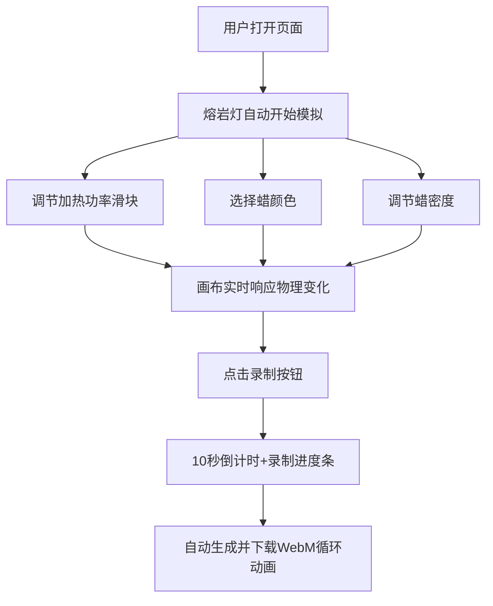

## 1. 产品概述

熔岩灯物理模拟器是一款基于真实物理原理的交互式熔岩灯定制工具。用户可以通过调节加热功率、蜡颜色和密度等参数，实时观察蜡块在灯内的受热上升、冷却下沉、拉伸、分裂与融合等流体动态效果，并可导出10秒循环动画。

- 核心目标：打造视觉逼真、参数可调的熔岩灯物理模拟体验
- 目标用户：设计爱好者、视觉艺术家、教育工作者及对流体物理感兴趣的用户
- 产品价值：将复杂的流体物理以直观可视的方式呈现，兼具艺术美感与科学教育意义

## 2. 核心功能

### 2.1 功能模块

1. **主舞台（熔岩灯画布）**：2D Canvas 实时渲染的熔岩灯物理模拟
2. **控制面板**：加热功率调节、蜡颜色选择器、密度滑块
3. **动画录制器**：10秒循环动画录制与导出（WebM/GIF）

### 2.2 页面详情

| 页面名称 | 模块名称 | 功能描述 |
|-----------|-------------|---------------------|
| 主页面 | 熔岩灯画布 | 基于Canvas的2D流体物理模拟，蜡块受热上升冷却下沉，拉伸分裂融合 |
| 主页面 | 控制面板 | 加热功率（0-100%）、蜡颜色（HSB色板）、蜡密度（0.3-1.2）三档调节 |
| 主页面 | 录制面板 | 录制按钮、倒计时显示、进度条、导出WebM格式动画 |
| 主页面 | 预设方案 | 3-5种经典熔岩灯配色/密度预设一键切换 |

## 3. 核心流程

## 4. 用户界面设计

### 4.1 设计风格

- **设计方向**：复古未来主义（Retro-Futuristic）+ 有机流体美学
- **主色调**：深色背景（#0a0a12），辅以霓虹暖色光晕
- **辅助色**：玻璃质感的半透明边框，金属暗银色控制元素
- **按钮风格**：圆角胶囊按钮，发光悬停效果，按压微缩放
- **字体**：标题使用 Space Grotesk 或同类几何无衬线字体；正文使用系统等宽字体
- **布局风格**：左侧主画布（熔岩灯）+ 右侧抽屉式控制面板
- **视觉元素**：噪点纹理叠加、玻璃拟态（Glassmorphism）、辉光发光效果

### 4.2 页面设计概览

| 页面名称 | 模块名称 | UI 元素 |
|-----------|-------------|-------------|
| 主页面 | 熔岩灯画布 | 圆角矩形容器、玻璃边缘高光、内部深色渐变、蜡块发光渲染、热对流光晕 |
| 主页面 | 控制面板 | 玻璃拟态卡片、滑块带渐变轨道、色板预设按钮、数值实时显示 |
| 主页面 | 录制面板 | 圆形录制按钮带脉动动画、进度条带发光描边、倒计时数字 |

### 4.3 响应式设计

- 桌面端（≥1280px）：左侧画布占65%宽度，右侧控制面板占35%
- 平板端（768-1279px）：上下布局，画布在上，控制面板折叠为可展开抽屉
- 移动端（<768px）：竖屏布局，画布全屏显示，控制面板以底部滑出抽屉形式呈现

### 4.4 视觉场景指导

- **环境氛围**：深色宇宙感背景，微弱星点噪点，熔岩灯为唯一强光源
- **光照设置**：蜡块自发光 + 底部加热区暖光、顶部冷却区冷光的对比色调
- **构图焦点**：熔岩灯居中偏左，占据视觉重心约60%面积
- **交互动画**：滑块拖动有实时物理参数变化反馈，录制按钮有呼吸发光效果
- **后处理**：Canvas内加 Bloom 发光、轻微色差（Aberration）、Vignette 暗角
