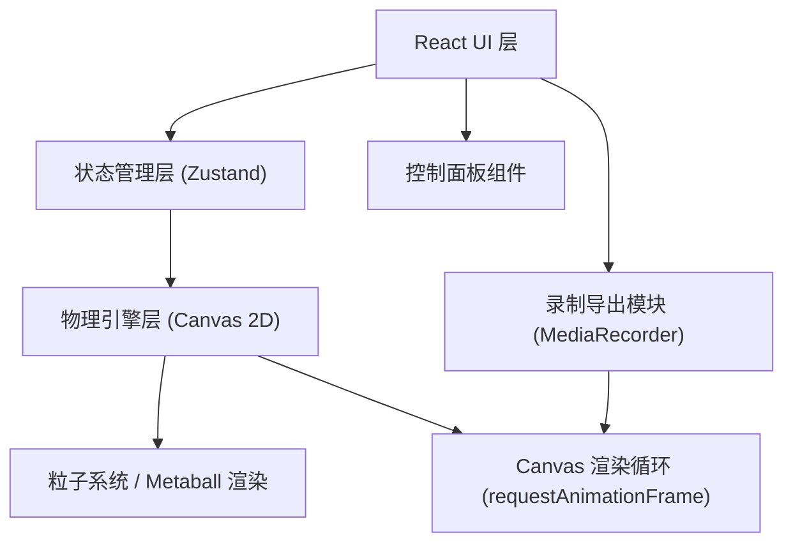

## 1. 架构设计



## 2. 技术选型

- **前端框架**：React 18 + TypeScript + Vite 6
- **样式方案**：Tailwind CSS 3
- **状态管理**：Zustand
- **渲染引擎**：HTML5 Canvas 2D API
- **物理模拟**：自研粒子系统 + Metaball（元球）算法实现流体融合效果
- **录制导出**：MediaRecorder API（WebM 格式）
- **图标库**：Lucide React

## 3. 目录结构

```
src/
├── components/
│   ├── LavaLampCanvas.tsx      # 熔岩灯主画布组件
│   ├── ControlPanel.tsx        # 控制面板（功率/颜色/密度）
│   ├── RecordPanel.tsx         # 录制导出面板
│   ├── PresetSelector.tsx      # 预设方案选择器
│   └── Slider.tsx              # 自定义滑块组件
├── hooks/
│   ├── useLavaPhysics.ts       # 物理引擎核心 Hook
│   ├── useMediaRecorder.ts     # 录制功能 Hook
│   └── useAnimationLoop.ts     # 动画循环 Hook
├── physics/
│   ├── ParticleSystem.ts       # 粒子系统类
│   ├── MetaballRenderer.ts     # Metaball 渲染器
│   └── LavaPhysics.ts          # 熔岩物理计算逻辑
├── store/
│   └── useLampStore.ts         # Zustand 全局状态
├── utils/
│   ├── colorUtils.ts           # 颜色转换工具
│   └── mathUtils.ts            # 数学工具函数
├── pages/
│   └── Home.tsx                # 主页面
├── App.tsx
├── main.tsx
└── index.css
```

## 4. 核心物理引擎设计

### 4.1 粒子系统

每个蜡块由多个粒子组成，每个粒子包含：
- `position: {x, y}` - 位置
- `velocity: {x, y}` - 速度
- `temperature: number` - 温度（影响密度和浮力）
- `radius: number` - 半径
- `mass: number` - 质量（与密度相关）

### 4.2 物理规则

1. **浮力计算**：基于温度差异，热粒子密度降低→上浮，冷粒子密度升高→下沉
2. **热传递**：底部加热区持续加热粒子，顶部冷却区降温粒子
3. **粒子间作用力**：相邻粒子间存在弱引力（融合效果）和强斥力（避免重叠）
4. **边界碰撞**：粒子与灯壁碰撞反弹，阻尼衰减
5. **拉伸变形**：基于速度方向动态调整粒子形状
6. **分裂/融合**：基于粒子间距和相对速度触发

### 4.3 Metaball 渲染

使用元球算法渲染蜡块融合效果：
- 对每个像素计算周围所有粒子的影响场总和
- 超过阈值的像素填充为蜡颜色
- 使用 Marching Squares 优化边缘平滑

## 5. 状态管理（Zustand）

```typescript
interface LampState {
  heatPower: number;           // 0-100
  waxColor: { h: number; s: number; b: number };
  waxDensity: number;          // 0.3-1.2
  isRecording: boolean;
  recordingProgress: number;
  setHeatPower: (v: number) => void;
  setWaxColor: (c: HSB) => void;
  setWaxDensity: (v: number) => void;
  startRecording: () => void;
  stopRecording: () => void;
}
```

## 6. 录制导出流程

1. 点击录制按钮 → Canvas.captureStream(60) 获取视频流
2. MediaRecorder 录制 10 秒
3. 停止后生成 Blob → 创建下载链接
4. 自动触发 WebM 文件下载
